<div align="center">

# E‑commerce Pro

**Full‑stack Laravel e‑commerce store with Stripe checkout, cash on delivery, and an admin control panel.**

[](https://laravel.com)
[](https://www.php.net/)
[](LICENSE)

*A portfolio‑grade project demonstrating authentication, payments integration, role‑based areas, and operational tooling for running an online shop.*

</div>

---

## Overview

This application is a **complete shopping experience** for customers and a **dedicated back office** for administrators. Customers can browse a catalog, manage a cart with **flexible quantities** (single items or larger volumes), and complete checkout either **online via Stripe** or **cash on delivery**. The storefront includes a **public comments area with replies** so users can share feedback. Administrators use a **separate dashboard** to manage categories, products, orders, and fulfillment—including **PDF order exports** for records or shipping.

---

## Why this project exists

Built as a **learning and demonstration codebase**, it shows how common e‑commerce concerns fit together in **Laravel**: verified user accounts, payment flows, order lifecycle, inventory presentation (including sale pricing), and admin workflows suitable for a small or medium online business.

---

## Key features

### Storefront (customer)

| Area | What it does |
|------|----------------|
| **Catalog & discovery** | Home page with featured sections, paginated product listing, and authenticated product search across title, description, price, and category. |
| **Product detail** | Images, category, description, stock quantity, regular price, and optional **discount price** when on sale. |
| **Cart** | Add items with **quantity**; line totals respect discounted unit price when applicable; merge quantities when adding the same product again. |
| **Checkout** | **Stripe** card payment (server‑side charge flow) **or** **cash on delivery**; orders created from cart with payment and delivery status. |
| **Orders** | View personal order history and cancel pending orders when needed. |
| **Community** | **Comments** on the main page plus **threaded replies** for discussion. |

### Admin control panel

| Area | What it does |
|------|----------------|
| **Dashboard** | At‑a‑glance metrics: total products, orders, customers (non‑admin users), revenue sum, delivered vs pending orders. |
| **Categories** | Create and delete product categories. |
| **Products** | Create, list, update, and delete products with **image uploads**, pricing, discount pricing, quantity, and category assignment. |
| **Orders** | List all orders; **mark orders delivered** (updates delivery and payment flags); **search** orders by customer name, phone, product title, or status fields; **download PDF** with order details. |

### Account & security

- **Laravel Jetstream** UI stack with **Fortify** authentication.
- **Email verification** for registered users (`MustVerifyEmail`).
- Optional **two‑factor authentication** and **API tokens** (Sanctum) via Jetstream where enabled.
- **Role‑based landing**: users with `user_type = admin` are sent to the admin dashboard after login; others see the storefront.

---

## Screenshots

Assets are in [`public/docs/screenshots/`](public/docs/screenshots/) (also available at `/docs/screenshots/…` when the app is served from `public/`).

### Storefront

| | |
| --- | --- |
| 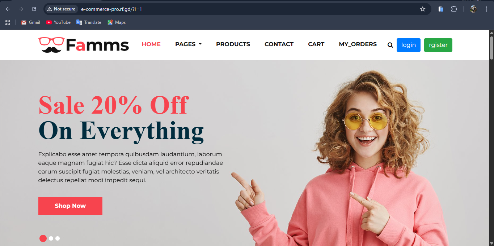 | 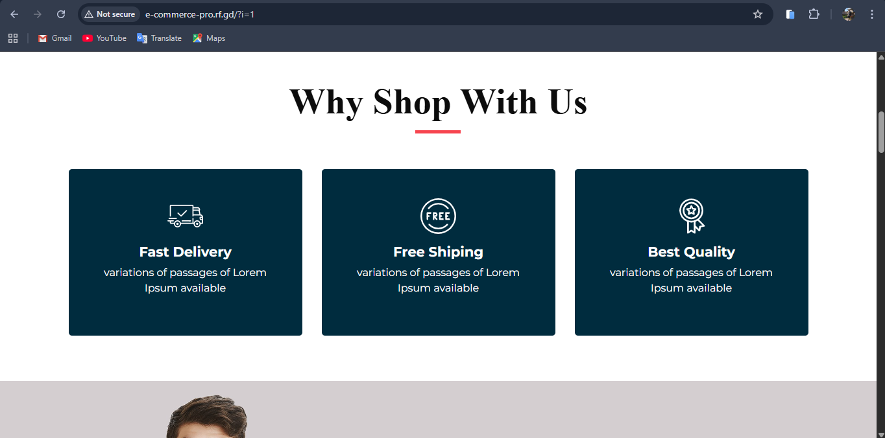 |
| *Home — hero* | *Home — featured slider* |
| 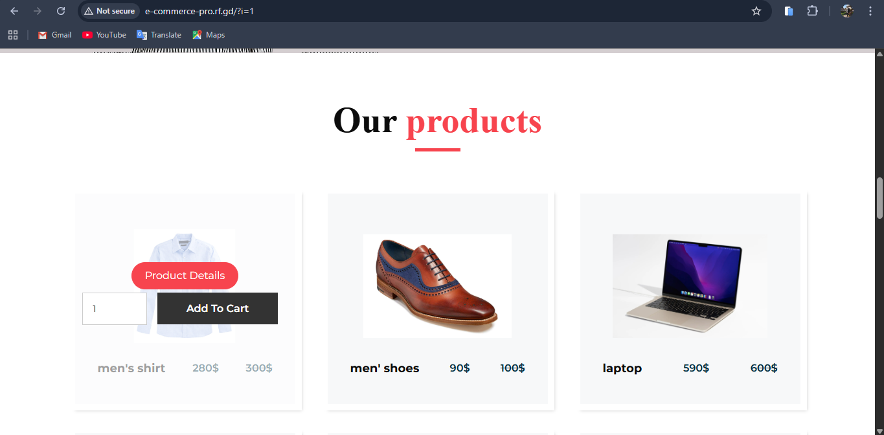 | 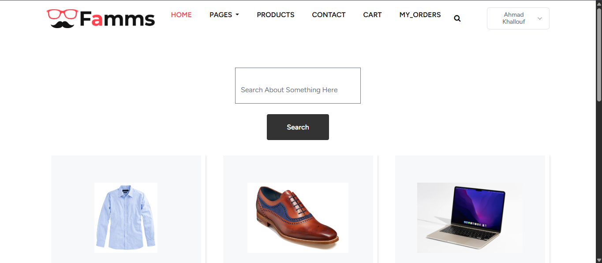 |
| *Home — products* | *Catalog / listing* |
| 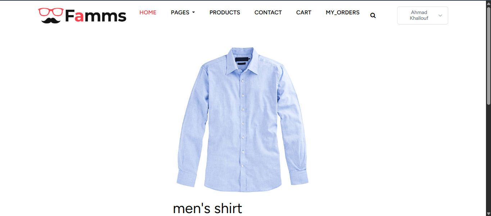 | 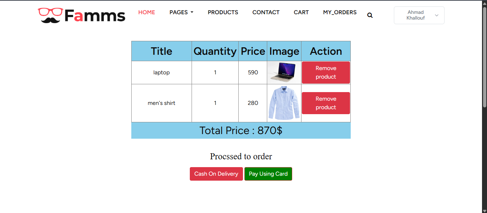 |
| *Product detail & quantity* | *Cart* |
| 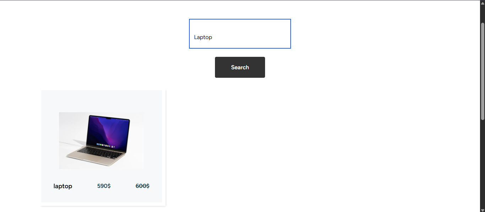 | 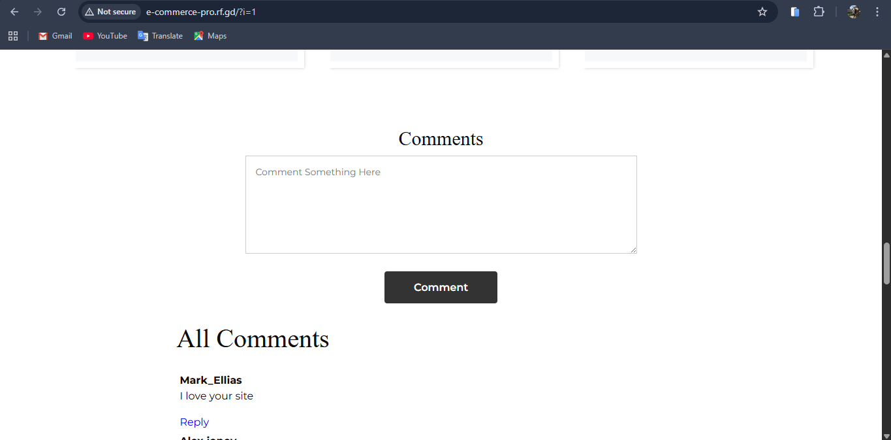 |
| *Product search* | *Comments* |

### Checkout & orders

| | |
| --- | --- |
| 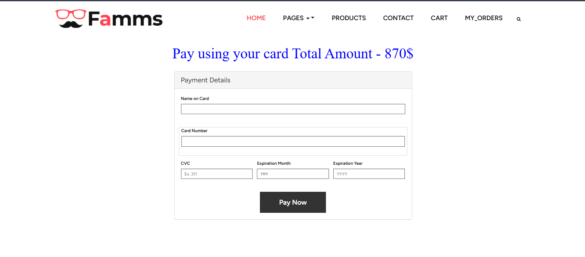 | 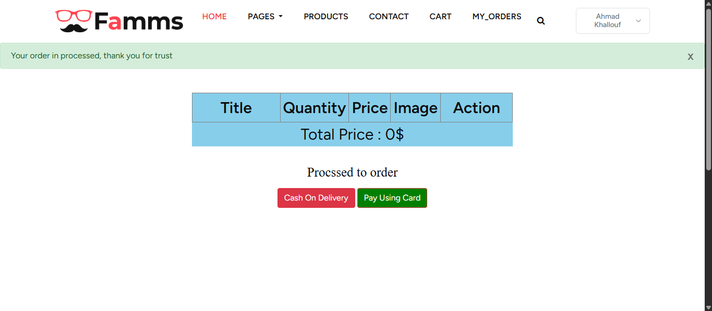 |
| *Stripe payment* | *Cash on delivery* |
| 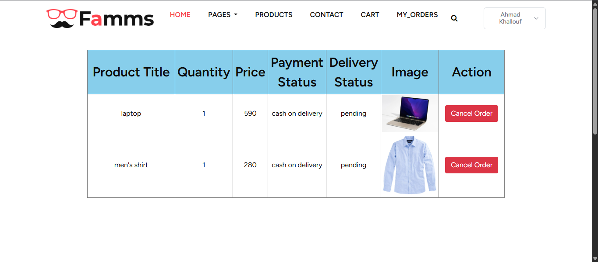 | 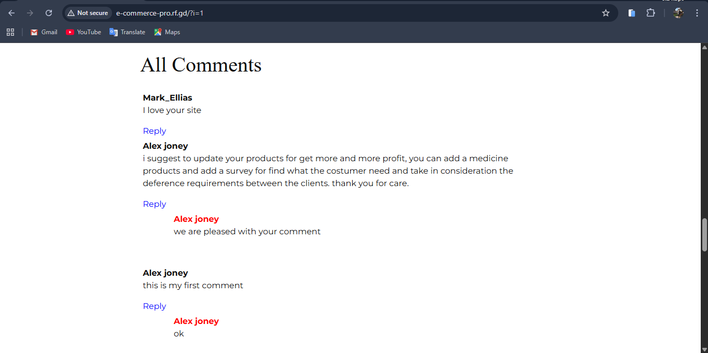 |
| *Order history* | *Comments (alternate view)* |

### Authentication (Jetstream)

| | |
| --- | --- |
| 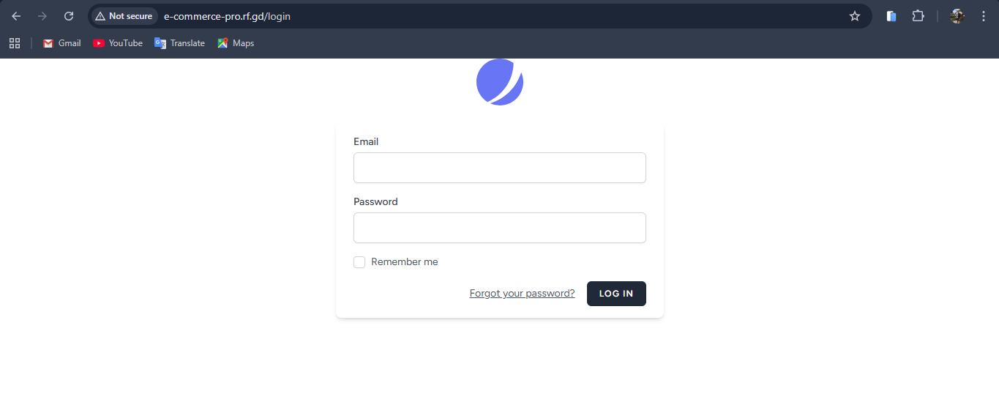 | 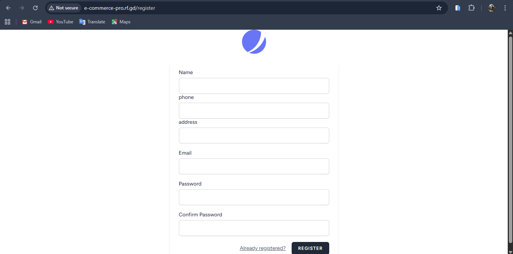 |
| *Login* | *Register* |

### Admin control panel

| | |
| --- | --- |
| 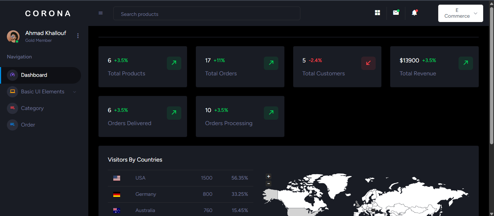 | 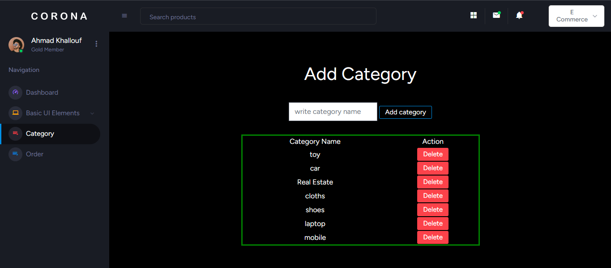 |
| *Dashboard & KPIs* | *Categories* |
| 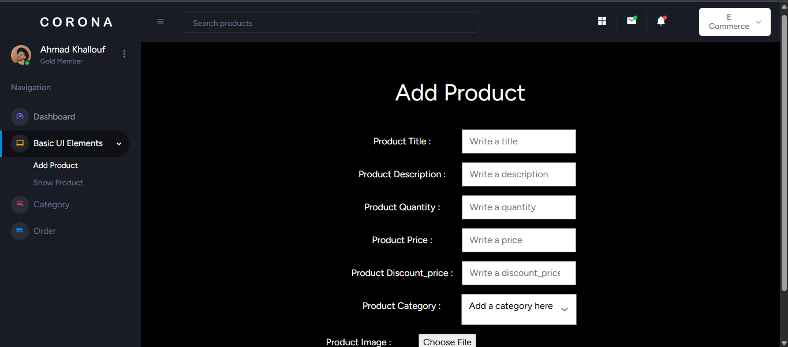 | 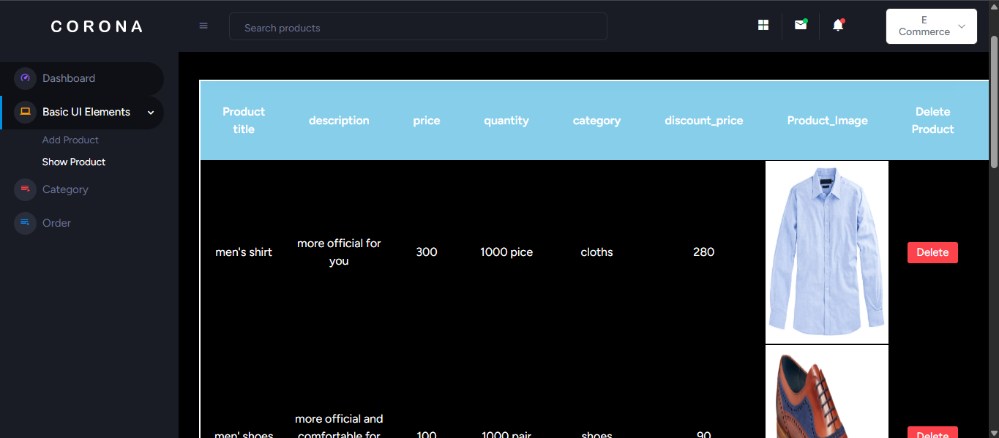 |
| *Add product* | *Product list* |
| 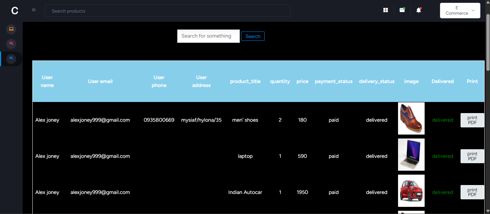 | 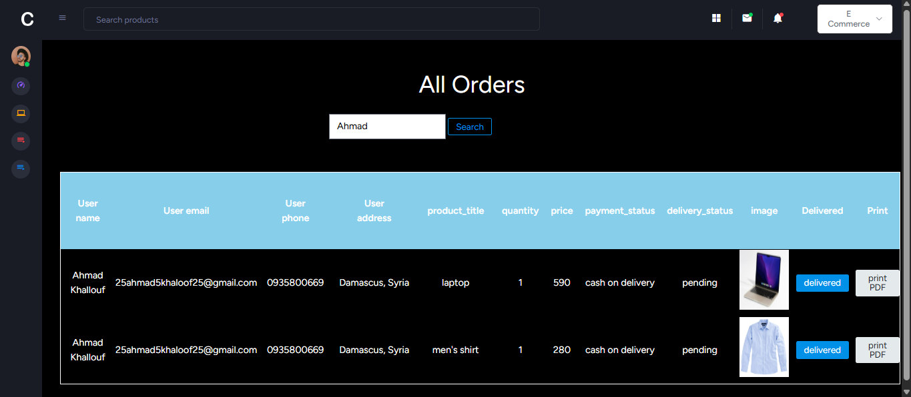 |
| *Orders* | *Order search* |
| 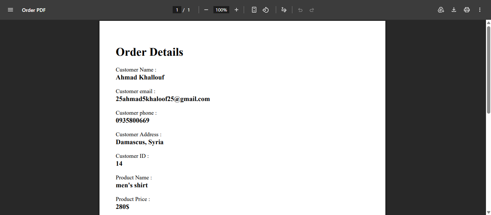 | 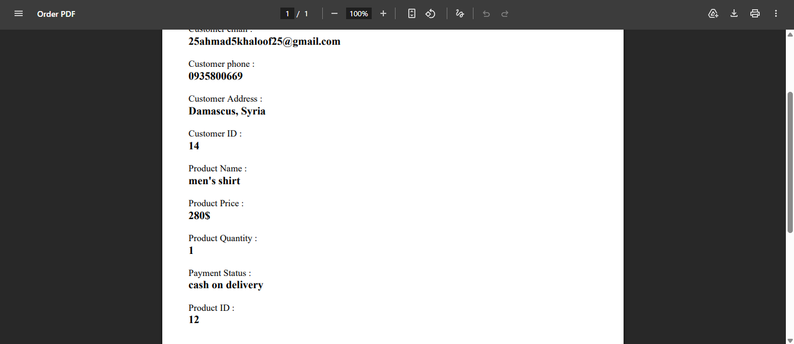 |
| *Order PDF export* | *PDF detail (alternate)* |

*Extra captures* (`*2` variants, alternate angles) are in the same folder if you want to swap any image above.

---

## Tech stack

| Layer | Technologies |
|--------|----------------|
| **Backend** | Laravel 9, PHP 8+, Eloquent ORM, session/auth middleware |
| **Auth & UI scaffold** | Laravel Jetstream, Livewire 2, Laravel Fortify, Laravel Sanctum |
| **Payments** | Stripe PHP SDK (`stripe/stripe-php`) — Charges API |
| **PDF** | barryvdh/laravel-dompdf |
| **Frontend (shop)** | Blade, Bootstrap‑based template (`public/home`), jQuery |
| **Frontend (admin)** | Blade, Corona‑style admin theme (`public/admin`) |
| **Frontend (Jetstream)** | Vite, Tailwind CSS, Alpine.js |
| **Database** | MySQL (default configuration) |

---

## Architecture (high level)

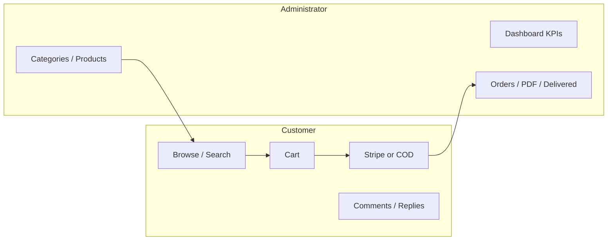

- **Routes** in `routes/web.php` wire **HomeController** (store, cart, checkout, comments, search) and **adminController** (admin CRUD and orders).
- **Images** for products are stored under `public/ProductImage`.
- **Orders** persist payment method outcome (`Paid` vs `cash on delivery`) and delivery state (`pending`, `delivered`, or user‑cancelled message).

---

## Getting started

### Requirements

- PHP **≥ 8.0.2** with common extensions (openssl, pdo, mbstring, tokenizer, xml, ctype, json)
- **Composer**
- **Node.js** + npm (for Vite / Jetstream assets)
- **MySQL** (or adapt `.env` for your database)

### Installation

```bash
git clone <your-repository-url>
cd E-commerce-pro
composer install
cp .env.example .env
php artisan key:generate
```

Configure **database** credentials in `.env`, then:

```bash
php artisan migrate
npm install
npm run build
php artisan serve
```

### Stripe (online payments)

Add your secret key to `.env`:

```env
STRIPE_SECRET=sk_test_...
```

Use Stripe **test** keys in development. The app uses the Stripe **Charges** API with a token from the payment form (`stripePost` in `HomeController`).

### Creating an admin user

Users default to `user_type = user` in the database. To access the **admin dashboard**, set **`user_type`** to **`admin`** for your user row (e.g. via your DB client or a one‑off tinker command) after registering.

---

## Project layout (not exhaustive)

| Path | Role |
|------|------|
| `app/Http/Controllers/HomeController.php` | Store, cart, Stripe/COD, orders, comments, search |
| `app/Http/Controllers/adminController.php` | Admin categories, products, orders, PDF |
| `resources/views/home/` | Storefront Blade views |
| `resources/views/admin/` | Admin panel Blade views |
| `database/migrations/` | Schema for users, products, carts, orders, comments, replies |

---

## Testing

```bash
php artisan test
```

---

## License

This project is open‑sourced under the [MIT license](https://opensource.org/licenses/MIT).

---

<div align="center">

**Built with Laravel — demonstrating real‑world e‑commerce patterns end to end.**

</div>
